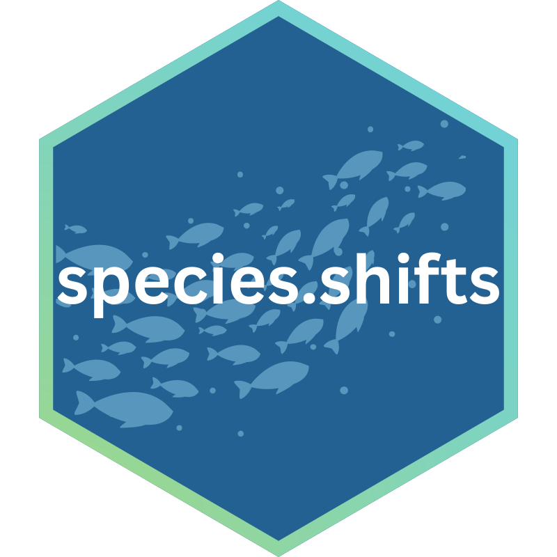
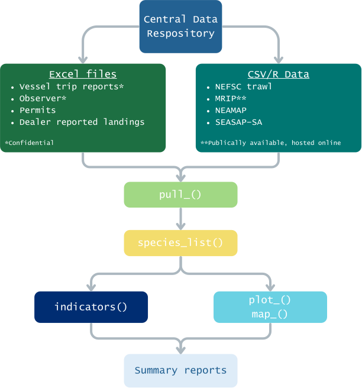

<!-- README.md is generated from README.Rmd. Please edit that file -->

# species.shifts <a href="https://carlylovas.com"></a>

<!-- badges: start -->

<!-- badges: end -->

The goal of `species.shifts` is to consolidate a variety of federal data
sets commonly used by the [**Gulf of Maine Research
Institute**](https://www.gmri.org/) in Portland, Maine. Many of the data
sets support collaborations with the New England, Mid-Atlantic, and
South Atlantic Fisheries Management Councils. This package pulls,
cleans, and analyzes these data sets from a pre-existing data
repository. Many of these data sets are confidential and/or require an
explicit data request from the relevant bodies. Given data acquisition,
it is recommended to store all data in a central repository for ease of
access within the R functions.

------------------------------------------------------------------------

## Work flow

There are a set of functions within this package to pull, clean, and
plot federal fisheries data. Any `pull_()` function will read in and
clean the data from the corresponding data set.

`species_list()` contains a list of species that are of interest to the
[Mid-Atlantic Fisheries Management Council](https://www.mafmc.org/). It
contains how these species are named in each particular data set and a
`clean_name`, which is the same across all data sets. If species need to
be added or removed before subsequent analyses, please amend this
function as needed.

All functions that begin with `map_()` or `plot_()` will filter to the
species of interest, so long as they are included in the species list.
The `pull_()` function for that particular data set will need to be run
prior to any plotting function.

*In development:* `indicators()` will analyze and return a specific set
of species distribution shift indicators for a particular species or set
of species.

All three groups of functions will ultimately yield the materials needed
to generate a **summary report**, describing the patterns of
distribution as described across the federal fishery dependent and
independent data sets.

<p align="center">


</p>

------------------------------------------------------------------------

## Featured Data Sets

[NOAA Fisheries Vessel Trip
Reports](https://www.fisheries.noaa.gov/inport/item/11489)

[NEFSC Observer at
Sea](https://www.fisheries.noaa.gov/inport/item/24111)

[NEFSC Spring-Fall Bottom Trawl
Survey](https://www.fisheries.noaa.gov/inport/item/22557)

[GARFO Permits Data](https://apps-garfo.fisheries.noaa.gov/permits/)

[GARFO Dealer Reported
Landings](https://www.fisheries.noaa.gov/contact/greater-atlantic-regional-fisheries-office)

[NOAA Fisheries Marine Recreational Information
Program](https://www.fisheries.noaa.gov/insight/marine-recreational-information-program)

## Installation

You can install the development version from [GitHub](www.github.com)
with:

``` r
devtools::install_github("https://github.com/carlylovas/species.shifts")
```

## Vignettes

*In development*
